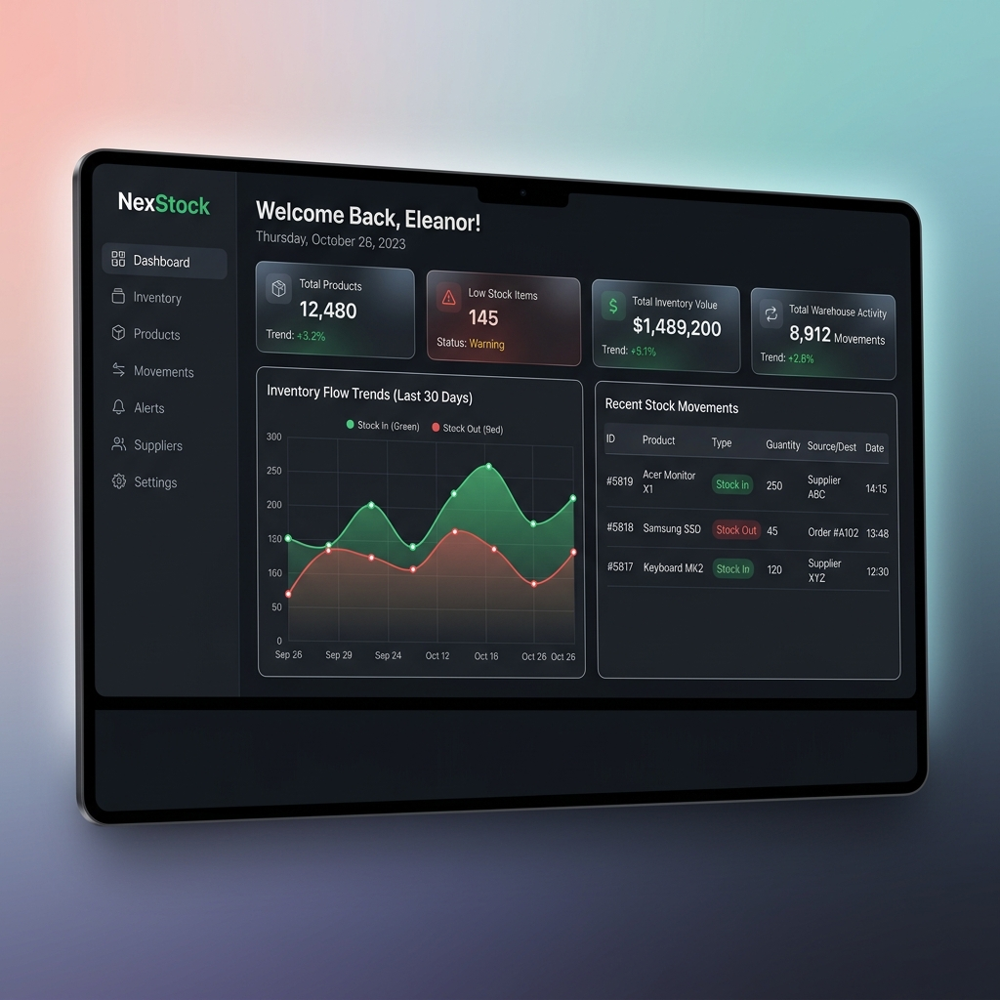

# NexStock – Warehouse Intelligence & Inventory Management Platform

NexStock is a modern, high-performance warehouse intelligence and inventory management solution. It empowers logistics teams and warehouse managers with real-time stock monitoring, role-based controls, dynamic dashboards, and automated report exports.

---

## Architecture Overview

NexStock is engineered using a clean, layered architecture separating database operations, business logic, API routing, and interactive visualization:
- **Client Application**: Single Page Application (SPA) built with React and TypeScript.
- **API Services**: FastAPI high-performance Python framework.
- **Data Layer**: PostgreSQL database powered by SQLAlchemy ORM and Alembic migrations.

For more details on the architecture layers, refer to [Architecture Documentation](docs/architecture.md).

---

## Features

- **Authentication**: Secure JWT-based session management.
- **Role-Based Access Control**: Differentiated operations for `Admin` and `Manager` roles.
- **Product Management**: Complete SKU tracking, category mapping, and pricing details.
- **Category Management**: Case-insensitive unique naming restrictions and safe deletions.
- **Inventory Tracking**: Minimum/maximum stock alert thresholds.
- **Stock Movement Monitoring**: Full historical auditing of stock inflow (`IN`) and outflow (`OUT`) with creator details.
- **Analytics Dashboard**: Graphical insights of stock movements, KPI cards, and low stock warnings.
- **Reporting System**: Custom reports for current stock, low stock thresholds, and CSV data exports.

---

## Tech Stack

### Backend
- **Core Framework**: [FastAPI](https://fastapi.tiangolo.com/) (Python 3.10+)
- **ORM & Migrations**: [SQLAlchemy 2.0](https://www.sqlalchemy.org/) & [Alembic](https://alembic.sqlalchemy.org/)
- **Authentication**: Passlib (Bcrypt) & PyJWT
- **Database**: PostgreSQL (Neon Serverless Database)

### Frontend
- **Build Tool & Framework**: [Vite](https://vitejs.dev/) & [React 18](https://react.dev/)
- **Language**: TypeScript
- **Styling**: [Tailwind CSS](https://tailwindcss.com/)
- **State & Forms**: React Hook Form, Axios, Zod
- **Charts**: [Recharts](https://recharts.org/)

---

## Installation & Setup

### Prerequisites
- Python 3.10 or higher
- Node.js 18 or higher
- PostgreSQL Database Instance

### Backend Setup

1. Navigate to the backend folder:
   ```bash
   cd backend
   ```
2. Create and activate a Python virtual environment:
   ```bash
   python -m venv .venv
   # Windows:
   .venv\Scripts\activate
   # macOS/Linux:
   source .venv/bin/activate
   ```
3. Install dependencies:
   ```bash
   pip install -r requirements.txt
   ```
4. Configure environment variables. Copy `.env.example` to `.env` and fill in the connection details:
   ```bash
   cp .env.example .env
   ```
5. Apply database migrations:
   ```bash
   alembic upgrade head
   ```
6. Run database seed scripts (optional, for initial test accounts):
   ```bash
   python scripts/seed_all.py
   ```
7. Start the development server:
   ```bash
   uvicorn app.main:app --reload
   ```
   The backend will be available at `http://127.0.0.1:8000`.

### Frontend Setup

1. Navigate to the frontend folder:
   ```bash
   cd ../frontend
   ```
2. Install dependencies:
   ```bash
   npm install
   ```
3. Configure environment variables. Create a `.env` file from `.env.example`:
   ```bash
   cp .env.example .env
   ```
4. Start the frontend local server:
   ```bash
   npm run dev
   ```
   The frontend will be available at `http://localhost:5173`.

---

## Screenshots

### Analytics Dashboard
Below is a mockup preview of the interactive dark-themed NexStock control panel:



---

## Future Roadmap

- **Multi-Warehouse Support**: Handle stock tracking across different physical locations.
- **Barcode & QR Scanning**: Native integration with mobile cameras for rapid stock-in/out scanning.
- **AI-Powered Reorder Notifications**: Auto-calculate optimal order thresholds based on past sales and stock velocities.
- **Supplier Directory**: Associate supplier profiles directly with product listings for automated purchase ordering.

---

## License

Distributed under the MIT License. See [LICENSE](LICENSE) for more information.
