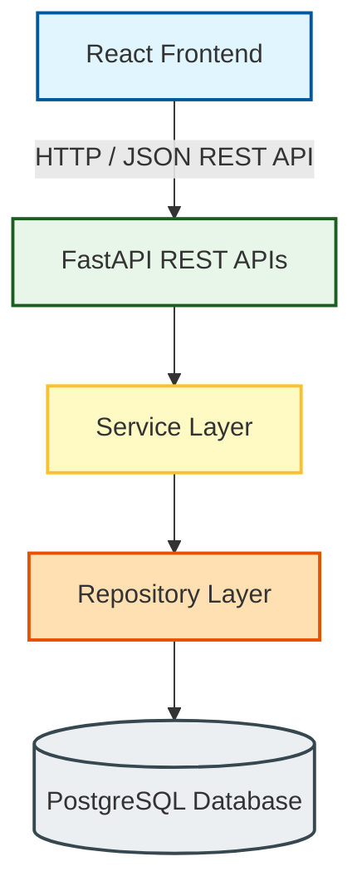

# NexStock Architecture Documentation

This document describes the architectural design and structural layers of the NexStock Warehouse Intelligence & Inventory Management Platform.

## System Architecture

NexStock is built using a clean, layered architecture separating concerns between the client-side user interface and the server-side business logic.



### Flow Diagram

```text
React Frontend
      │
      ▼
FastAPI REST APIs
      │
      ▼
Service Layer
      │
      ▼
Repository Layer
      │
      ▼
PostgreSQL Database
```

---

## Architecture Layers

### 1. React Frontend
- **Technology Stack**: React, TypeScript, Tailwind CSS, Vite, Recharts, Axios, React Hook Form, Zod.
- **Responsibilities**:
  - Handles client-side routing (React Router) and route protection based on JWT tokens.
  - Form validations via `zod` and `react-hook-form`.
  - Data visualization for inventory trends, analytics, and stock levels using `recharts`.
  - UI state and local storage token management.

### 2. FastAPI REST APIs
- **Technology Stack**: FastAPI, Uvicorn, Pydantic (v2).
- **Responsibilities**:
  - Exposes RESTful HTTP endpoints for categories, products, inventory, authentication, dashboard stats, and reports.
  - Handles request and response serialization and schema validation using Pydantic schemas.
  - Implements dependency injection for DB sessions and JWT user authentication checks (`get_current_user`).
  - Standardizes error responses (e.g., handling global exceptions and formatting response structures).

### 3. Service Layer
- **Technology Stack**: Pure Python.
- **Responsibilities**:
  - Contains all business logic, validation rules, aggregations, and calculations.
  - Coordinates transactions (e.g., automatically creating inventory records when products are added).
  - Enforces logic boundaries (e.g., preventing deletion of categories with active products, checking stock availability on stock-out).

### 4. Repository Layer
- **Technology Stack**: SQLAlchemy ORM (v2).
- **Responsibilities**:
  - Executes raw database CRUD operations, session updates, and queries.
  - Isolates database query patterns from business logic.
  - Defines entity models corresponding to database tables.

### 5. PostgreSQL Database
- **Technology Stack**: PostgreSQL database (Neon serverless postgres in development/production), Alembic for migrations.
- **Tables**:
  - `roles`: System access levels (`Admin`, `Manager`).
  - `users`: Registered users, hashed passwords, and assigned roles.
  - `categories`: Product classifications.
  - `products`: Active product listings with unique SKUs.
  - `inventory`: Tracking quantities, thresholds (`minimum_quantity`, `maximum_quantity`).
  - `stock_movements`: Historical records of stock changes (`IN` / `OUT` movements with user logging).
